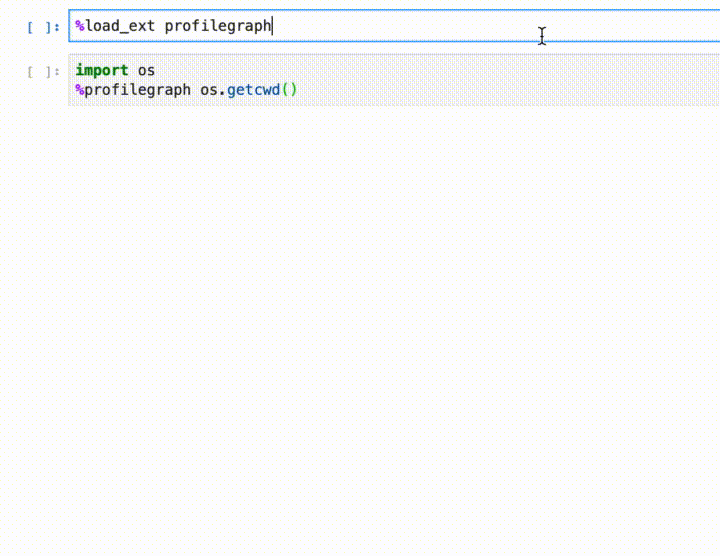
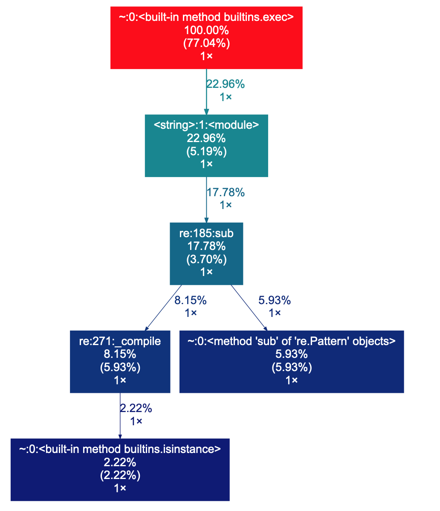

# `profilegraph`

A line magic for displaying `cProfile` results in graph form. Like `%time`, but
with far more information (with the performance penalty you'd expect from
`cProfile.run`).



## Install

This package requires Jupyter with a python kernel to be installed. The only
other python dependency is
[`gprof2dot`](https://github.com/jrfonseca/gprof2dot), which is used to convert
`cProfile` output to a `graphviz`-compatible dotfile and is installed by pip
automatically, and a [`graphviz`](https://www.graphviz.org/download/) binary,
which is used to render the SVG output. You can install `graphviz` from the
provided download link or using the package manager of your choice.

Inspired by
[mattijn/gprof2dot_magic](https://github.com/mattijn/gprof2dot_magic).

```bash
pip install profilegraph
```

## Use

Load the extension in a Jupyter notebook:

```python
%load_ext profilegraph
```

Profile a line of code by sticking `%profilegraph` at the start:

```python
import re
%profilegraph re.sub("biz", "baz", "foobarbiz")
```



## Develop

`profilegraph` uses [`flit`](https://flit.readthedocs.io/en/latest/). Install
`flit` with `pip install flit`.

Install in editable mode with:

```bash
flit install [--symlink] [--python path/to/python]
```

Upload to PyPI with:

```bash
flit publish
```
